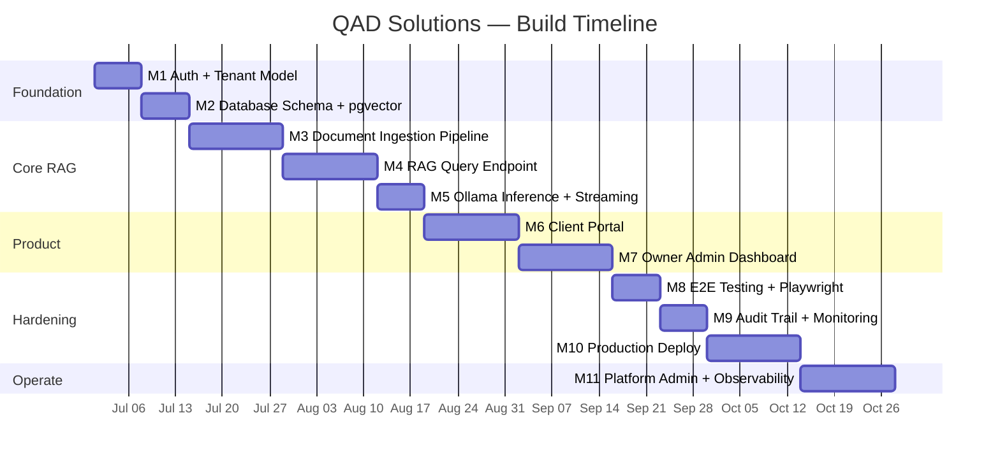

# ROADMAP — QAD Solutions

Production build timeline for the private multi-tenant RAG platform.
Each milestone maps to a GitHub Milestone. Update the status column when a milestone ships.

> **Milestone numbering is authoritative in the GitHub Milestones (M1–M11) and mirrored in
> CLAUDE.md.** This file must stay consistent with CLAUDE.md's Build Order and Roles & admin
> model. The three roles — `user` (Client Portal, M6), `admin` (Owner Admin Dashboard, M7,
> per-tenant), `platform_admin` (Platform console, M11, cross-tenant via `service_role`) — drive
> the M6/M7/M11 split below.

---

## Milestone Status

| Milestone | Name | Target | Status |
|---|---|---|---|
| M1 | Auth + Tenant Model | Week 1 | 🔲 Pending |
| M2 | Database Schema + pgvector | Week 2 | 🔲 Pending |
| M3 | Document Ingestion Pipeline | Week 3–4 | 🔲 Pending |
| M4 | RAG Query Endpoint | Week 5–6 | 🔲 Pending |
| M5 | Ollama Inference + Streaming | Week 7 | 🔲 Pending |
| M6 | Client Portal | Week 8–9 | 🔲 Pending |
| M7 | Owner Admin Dashboard | Week 10–11 | 🔲 Pending |
| M8 | E2E Testing + Playwright | Week 12 | 🔲 Pending |
| M9 | Audit Trail + Monitoring | Week 13 | 🔲 Pending |
| M10 | Production Deploy + Hardening | Week 14–16 | 🔲 Pending |
| M11 | Platform Admin + Observability | Week 17–18 | 🔲 Pending |

Status key: 🔲 Pending · 🟡 In Progress · ✅ Complete · ❌ Blocked

---

## Production Timeline

---

## Milestone Details

### M1 — Auth + Tenant Model (Week 1)

Exit criterion: cross-tenant isolation proven on the tables that exist in M1 (`tenants`/`users`).
Create Tenant A and Tenant B, seed each with its own user(s), query `users` under Tenant A
credentials, assert zero Tenant B rows (and vice versa). The documents/chunks-level isolation test
is an M2 follow-up, once those tables exist.

- [ ] Supabase Auth configured with JWT containing `tenant_id` + `user_role` claims
- [ ] `tenants` table with `id`, `name`, `slug`, `created_at`
- [ ] `users` table with `tenant_id` foreign key and `role` (`user` / `admin` / `platform_admin`)
- [ ] RLS policies: users can only read rows where `tenant_id` matches their JWT claim
- [ ] API middleware (`withTenant`) extracts and validates `tenant_id` from JWT on every request
- [ ] `tests/integration/tenant-isolation.test.ts` written and passing (on `users`/`tenants`)
- [ ] TypeScript strict mode enabled

---

### M2 — Database Schema + pgvector (Week 2)

- [ ] `pgvector` extension enabled in Supabase
- [ ] `documents` table: `id`, `tenant_id`, `name`, `status`, `source_url`, `created_at`, `updated_at`
- [ ] `document_chunks` table: `id`, `document_id`, `tenant_id`, `content`, `token_count`, `chunk_index`
- [ ] `embeddings` table: `id`, `chunk_id`, `tenant_id`, `embedding vector(768)`, `model_version`
- [ ] Operational tables: `retrieval_logs`, `model_calls`, `audit_logs`, `settings` (with RLS)
- [ ] HNSW index: `CREATE INDEX ON embeddings USING hnsw (embedding vector_cosine_ops) WITH (ef_construction=64, m=16)`
- [ ] RLS policies on all tenant-scoped tables (tenant_id isolation)
- [ ] `users.tenant_id` made nullable for `platform_admin`, locked by two complementary CHECKs (issue #69)
- [ ] Documents/chunks-level cross-tenant isolation test (M1 follow-up)
- [ ] All migrations tracked in `supabase/migrations/`

---

### M3 — Document Ingestion Pipeline (Week 3–4)

- [ ] `POST /api/documents/upload` — accepts PDF, DOCX, TXT, MD; returns `202 Accepted` immediately
- [ ] `documents.status` lifecycle: `uploading → processing → ready → error`
- [ ] Background job: parse → chunk (512 tokens, 64 overlap) → embed (nomic-embed-text) → store
- [ ] Re-ingestion deletes ALL old chunks/embeddings for the document before inserting new ones
- [ ] Error state written back to `documents.status` if any step fails
- [ ] `GET /api/documents/:id/status` endpoint for polling
- [ ] Max file size enforced (env: `MAX_FILE_SIZE_BYTES`)
- [ ] Vitest integration tests for ingestion pipeline

---

### M4 — RAG Query Endpoint (Week 5–6)

- [ ] `POST /api/query` — accepts `{ question: string }` from authenticated tenant user
- [ ] Embed question with same model as documents (nomic-embed-text)
- [ ] pgvector similarity search filtered by `tenant_id` (top-k from env: `RAG_TOP_K`)
- [ ] Prompt construction: system prompt + retrieved chunks + user question
- [ ] Response streamed to client (SSE, Vercel AI SDK)
- [ ] Persist a `conversations` + `messages` row per query (tenant-scoped) so history (M6) has data
- [ ] `retrieval_logs` + `model_calls` written per query
- [ ] Cross-tenant isolation test must still pass after this milestone

---

### M5 — Ollama Inference + Streaming (Week 7)

- [ ] Inference provider abstraction (`INFERENCE_PROVIDER=groq | ollama`)
- [ ] Vercel AI SDK streaming connected to Ollama via Cloudflare Tunnel
- [ ] `INFERENCE_PROVIDER=ollama` configured, Groq removed from production path
- [ ] Streamed response via SSE to browser
- [ ] Switch from Groq to Ollama verified: no real client data ever sent to Groq (SECURITY.md §2)

---

### M6 — Client Portal (Week 8–9)

Surface for the `user` role (staff at a client business) — their tenant only, RLS-scoped.

- [ ] Login page (Supabase Auth) — `app/portal/`
- [ ] Chat interface with streaming responses + citations
- [ ] Document upload UI with status polling
- [ ] Document list with status indicators (processing / ready / error)
- [ ] Conversation history (list + resume)

---

### M7 — Owner Admin Dashboard (Week 10–11)

Surface for the `admin` role (owner/manager of the client business) — **their tenant only**,
RLS-scoped. Cross-tenant tenant management lives in M11, not here.

- [ ] Admin auth + role gating (`admin`) — `app/admin/`
- [ ] Document management (list, upload, retire, re-ingest)
- [ ] User management within the tenant (invite, roles, deactivate) — last active admin cannot be
      deactivated or demoted (lockout guard, enforced by DB trigger)
- [ ] Audit log viewer (tenant-scoped) + usage metrics from `model_calls`
- [ ] Tenant settings management (read/write the `settings` table)

---

### M8 — E2E Testing + Playwright (Week 12)

- [ ] Playwright installed and configured
- [ ] E2E test: document upload → processing → ready → query → response
- [ ] E2E test: login → chat → logout
- [ ] E2E test: admin flows + UI-level tenant isolation
- [ ] CI Playwright job added to `.github/workflows/ci.yml`

---

### M9 — Audit Trail + Monitoring (Week 13)

- [ ] `audit_logs` table: `user_id`, `tenant_id` (nullable — NULL = fleet-wide platform action),
      `action`, `resource_type`, `resource_id`, `ip_address`, `created_at`
- [ ] INSERT-only RLS on `audit_logs` — no UPDATE or DELETE by any tenant role
- [ ] All mutating API routes write audit entries
- [ ] Audit-logger rejects writes where `tenant_id IS NULL` and actor is not `platform_admin`
- [ ] 90-day retention policy documented + cleanup job
- [ ] Basic error alerting configured (Vercel or Supabase dashboards)

---

### M10 — Production Deploy + Hardening (Week 14–16)

- [ ] Vercel Pro project configured (60s function timeout)
- [ ] All environment variables set in Vercel dashboard (not `.env.local`)
- [ ] Supabase production project (separate from dev) — hosted DB cutover + push migrations
- [ ] Custom domain configured
- [ ] Branch protection rules enabled on `main` and `dev` (`dev` introduced at M10)
- [ ] Final security review: OWASP checklist, NEXT_PUBLIC_ audit, RLS policy review
- [ ] Soft launch with first paying client (white-glove onboarding runbook)

---

### M11 — Platform Admin + Observability (Week 17–18)

Operator console for the `platform_admin` role — **cross-tenant**, via `service_role` (never RLS).
Separate from the tenant-facing app (SECURITY.md §3.4).

- [ ] Platform console route group gated to `platform_admin` (all others 403); cross-tenant reads via
      `service_role`, server-side only
- [ ] Tenant provisioning (create tenant + first `admin` user)
- [ ] Cross-tenant usage dashboard (fleet metrics)
- [ ] Pipeline observability + diagnostics (debug ingestion/query for any tenant)
- [ ] Plan tier + billing controls (`plan_tier`)
- [ ] Every platform-admin action written to `audit_logs` (fleet-wide actions: `tenant_id = NULL`)

---

## Release Tags

| Tag | Milestone | Notes |
|---|---|---|
| v0.4.0 | M4 | RAG endpoint working end-to-end |
| v0.7.0 | M7 | Full per-tenant product (Client Portal + Owner Admin) |
| v0.10.0 | M10 | Production launch — first paying client |
| v0.11.0 | M11 | Platform operator console + observability |
